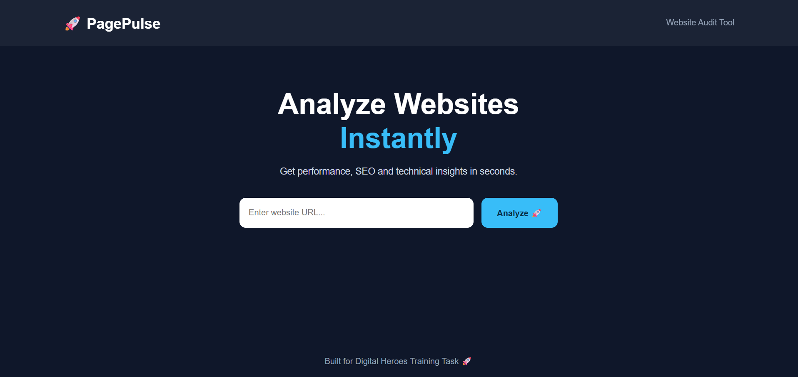
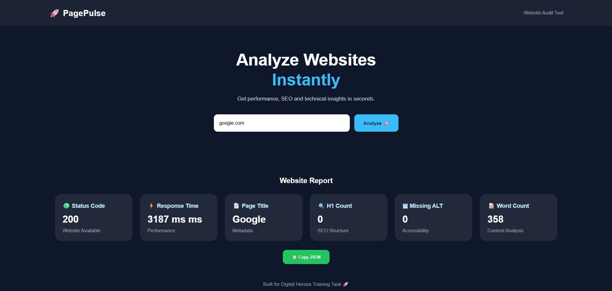

# 🚀 PagePulse - Website Audit Tool

A web-based website auditing tool that analyzes website performance, SEO structure, and accessibility metrics instantly.

## ✨ Features

- 🌐 Website availability checking
- ⚡ Response time analysis
- 📄 Page title extraction
- 🔍 H1 heading analysis
- 🖼 Missing image ALT detection
- 📝 Website word count analysis
- 📋 JSON report copy feature


## 🛠 Tech Stack

### Frontend
- React.js
- CSS3
- Vite

### Backend
- Node.js
- Express.js

### Libraries
- Axios
- Cheerio
- CORS


## 📂 Project Structure
PagePulse
│
├── client
│ ├── src
│ └── React Application
│
├── server
│ ├── routes
│ ├── controllers
│ └── utils
│
└── README.md

## ⚙️ Installation

### 1. Clone Repository

 
```bash
git clone <https://github.com/swetha152005/Website-Audit-Analyzer>
```
```bash
cd PagePulse
```


### 2. Backend Setup
```bash 
cd server
```
```bash
npm install
```
```bash
node index.js
```


Backend will run on:
```bash
http://localhost:5000
```

### 3. Frontend Setup
```bash
cd client
```
```bash
npm install
```
```bash
npm run dev
``` 


### 🔗 API Endpoint
Analyze Website

POST
```bash
http://localhost:5000/api/audit
```

Request Body
```bash

{
  "url": "https://www.google.com"
}
```

Response Example
```bash
{
  "url": "https://www.google.com",
  "statusCode": 200,
  "responseTime": "507 ms",
  "title": "Google",
  "metaDescription": "No description",
  "h1Count": 0,
  "imagesWithoutAlt": 0,
  "wordCount": 358
}
```


## 📸 Screenshots

### Homepage




### Website Audit Report


